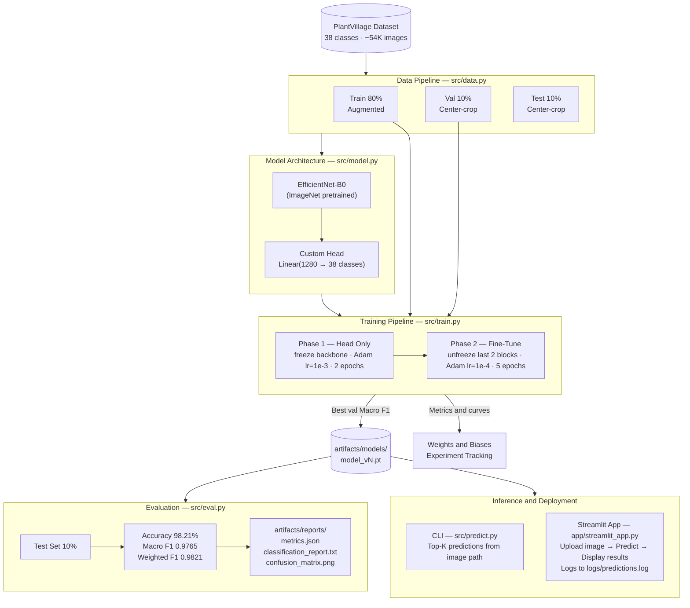

# Plant Disease Classification

A deep learning system for plant leaf disease detection using **transfer learning with EfficientNet-B0** trained on the **PlantVillage dataset**. The project includes a full machine learning pipeline: data preprocessing, model training, evaluation, experiment tracking, and deployment via a **Streamlit web application** for real-time predictions.

---

# System Architecture

---

# Model Architecture

The project uses **EfficientNet-B0** pretrained on ImageNet.

Training follows a two-phase transfer learning strategy:

### Phase 1 — Train Classification Head
- Freeze the EfficientNet backbone
- Train the classifier layer

### Phase 2 — Fine-Tune Backbone
- Unfreeze the last layers of EfficientNet
- Fine-tune with a smaller learning rate

This improves generalization while reducing training time.

---

# Model Performance

Evaluation on the held-out test set:

| Metric | Score |
|------|------|
| Accuracy | **98.21%** |
| Macro F1 Score | **0.9765** |
| Weighted F1 Score | **0.9821** |

---

Dataset source:

https://www.kaggle.com/datasets/abdallahalidev/plantvillage-dataset

---

# Tech Stack

### Machine Learning
- PyTorch
- Torchvision
- EfficientNet-B0 (transfer learning)

### Data Processing
- OpenCV
- PIL
- NumPy

### Evaluation
- Matplotlib

### Experiment Tracking
- Weights & Biases (W&B)

### Deployment
- Streamlit

### Development
- Python
- Git / GitHub
- VS Code